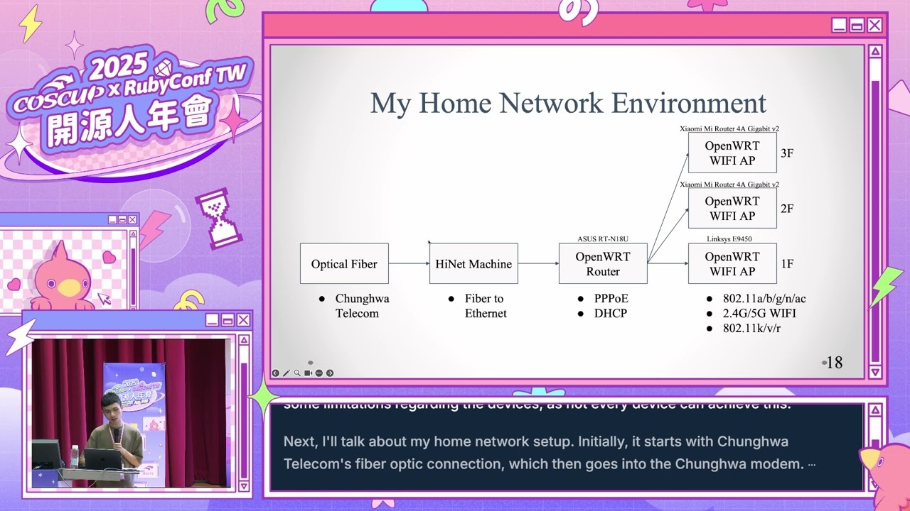

# COSCUP 2025 Open Source Home Network Environment
My COSCUP 2025 Session
\
開源家用網路環境 Open Source Home Network Environment

## Related Links
Session : https://coscup.org/2025/sessions/3LWSX3
\
Hackmd Note : https://hackmd.io/ryQn_9bOle
\
PPT URL : [PDF](https://shlink.frakw.work/coscup_2025_ppt)
## Recording
* [COSCUP Official Recording](https://youtube.com/watch?v=CosZLoVITLQ)

* [My Personal Recording](https://youtu.be/2CRczyjgx4s?si=m7-OK-k-5kpyLhkI)
